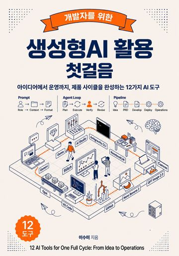
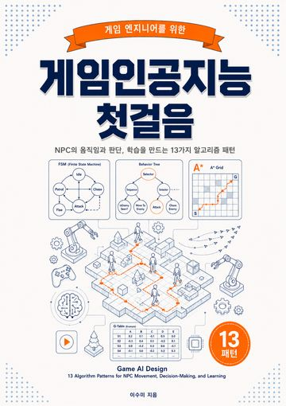
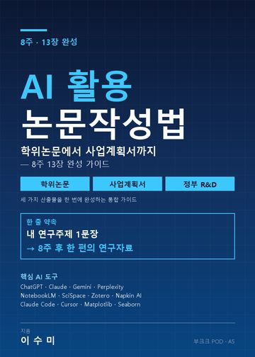
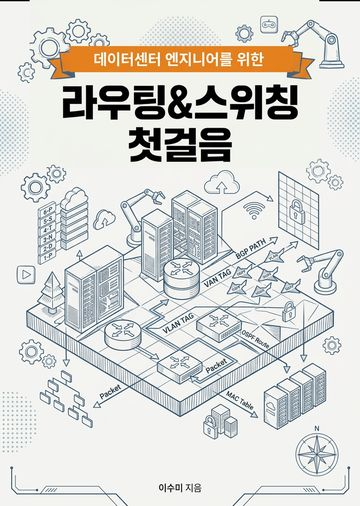
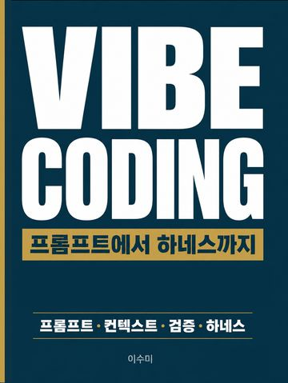
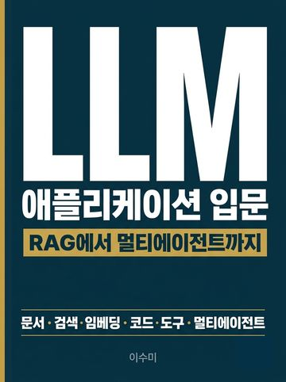
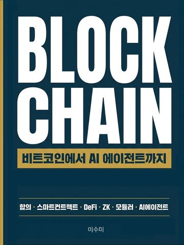

# 이수미 (Sumi Lee) | 인공지능 전문가

인공지능(AI) 전문가 이수미.
LLM 애플리케이션, 인공지능·블록체인 융합, 컴퓨터 비전, 그리고 AI 교육과 집필을 한 줄기로 잇는다.

AI specialist working across LLM applications, AI-blockchain convergence, computer vision, and AI education.

---

## 저서 (Books)

부크크(Bookk)에서 출간한 인공지능 입문서와 교재.

### 출간 (Published)

<table>
  <tr>
    <td align="center" width="25%">
       
      <b>생성형AI 활용 첫걸음</b> 
      개발자를 위한 입문서
    </td>
    <td align="center" width="25%">
       
      <b>게임인공지능 첫걸음</b> 
      게임 엔지니어를 위한 입문서
    </td>
    <td align="center" width="25%">
       
      <b>AI 활용 논문작성법</b> 
      학위논문에서 사업계획서까지
    </td>
    <td align="center" width="25%">
       
      <b>라우팅&스위칭 첫걸음</b> 
      데이터센터 엔지니어를 위한 입문서
    </td>
  </tr>
</table>

### 출간 예정 (Forthcoming)

<table>
  <tr>
    <td align="center" width="25%">
       
      <b>VIBE CODING</b> 
      프롬프트에서 하네스까지
    </td>
    <td align="center" width="25%">
       
      <b>LLM 애플리케이션 입문</b> 
      RAG에서 멀티에이전트까지
    </td>
    <td align="center" width="25%">
       
      <b>BLOCKCHAIN</b> 
      비트코인에서 AI 에이전트까지
    </td>
    <td align="center" width="25%"></td>
  </tr>
</table>

---

## 논문 (Publications)

### 학위논문 (Dissertations)
- **(Ph.D.)** Implementation of AI-Blockchain Convergence-based Regional Platform Service Mainnet: PAM-TALK and ESG-GOLD, 2026
- **(M.S.)** Development of Physical Computing Education Program for Elementary School Students Using Metaverse, 2022

### 학술지 (Journal Articles, KCI)
- Strategies for Enhancing Object Detection Performance in Intelligent Traffic Environment Control Systems Utilizing Public Data, 2025
- A Comparative Study of Platform-based Mainnet Design, 2025
- Development of an LLM-based Conversational Blockchain Serious Education Game, 2026

### 학술대회 (Conference Papers)
- Interactive Unity Game on Recognizing and Sensing Multi-Modal with AI Computer Vision, 2023
- Developing a Specialized High School Career Program using Generative AI Services, 2023
- Analysis of Immersion and Learning Effects Centered on Apple Vision Pro and Unity Game Engine, 2024

---

## 분야 (Research Interests)

- 인공지능 / LLM 애플리케이션 설계 (RAG, 에이전트, 프롬프트와 컨텍스트 엔지니어링)
- 인공지능·블록체인 융합, 메인넷 설계와 구현
- 컴퓨터 비전, 멀티모달 인식
- 인공지능 교육 (대학 교재, 기업 워크숍, 입문서 집필)

---

## 기술 스택 (Skills)

---

## GitHub

